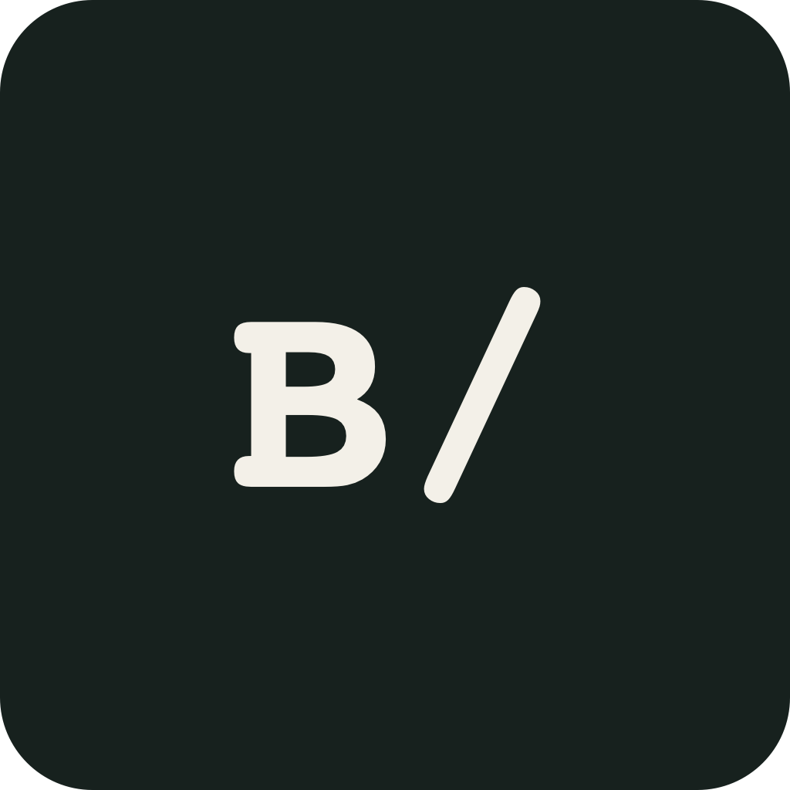
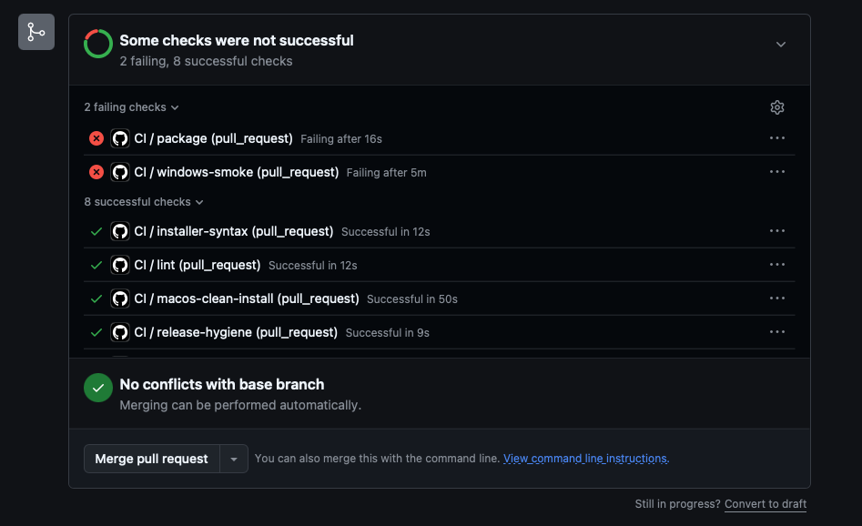
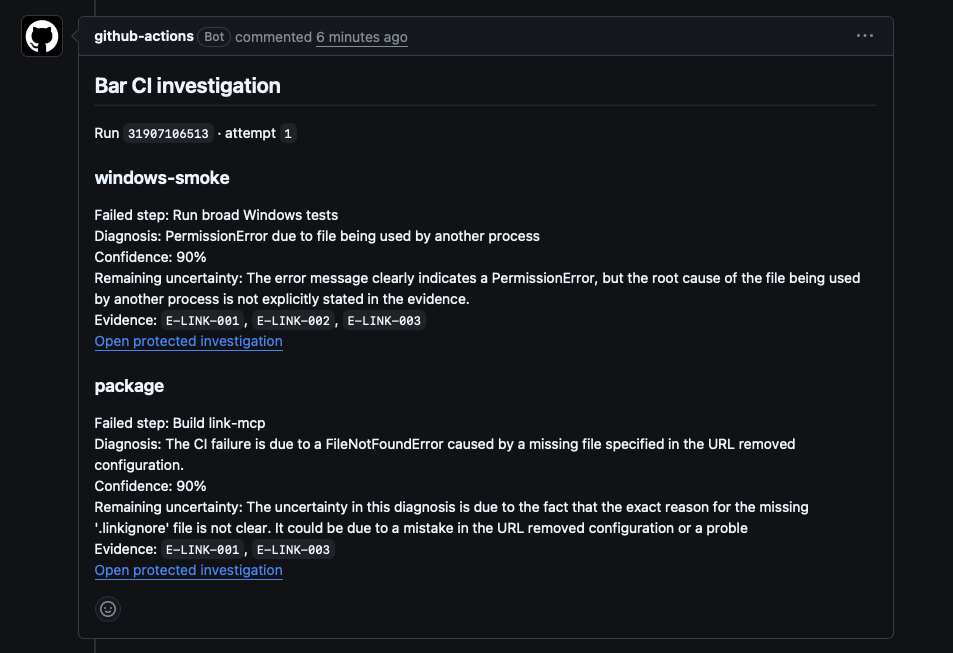
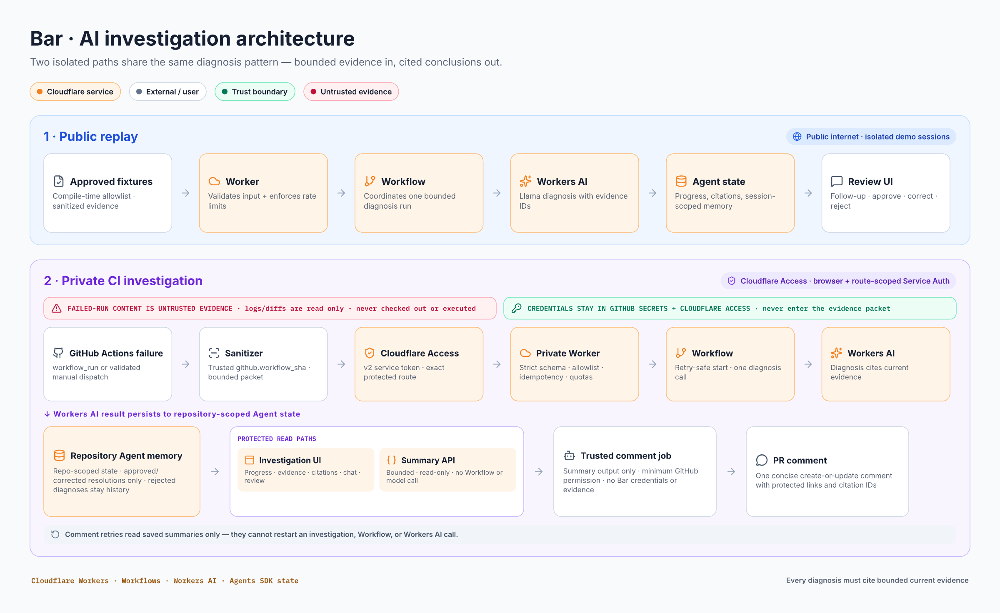

<p align="center">
  
</p>

# Bar

Bar investigates failed CI jobs. It collects a bounded packet of sanitized
evidence, runs one diagnosis call on Cloudflare, posts a concise cited result to
the related pull request, and gives the developer an Access-protected page for
reviewing the full investigation.

The current GitHub collector and private allowlist are configured for
[`gowtham0992/link`](https://github.com/gowtham0992/link). The packet format,
workflow, and review model can be adapted to another repository, but that work
is not automatic: a deployment must define its own trusted collector, evidence
rules, and repository/workflow allowlist.

## Run the checks

```sh
npm ci
npm run check
```

`npm run check` runs TypeScript checks, the Worker unit tests, and the tests
against real SQLite-backed Agent storage. The browser suites are separate:

```sh
npm run test:e2e
npm run test:e2e:private
```

The Playwright suites exercise desktop and mobile layouts. The private suite
uses the tracked placeholder configuration and does not require private
deployment values; see [Private deployment](#private-deployment).

## End-to-end example

The first fixtures came from two failures in
[Link PR #60](https://github.com/gowtham0992/link/pull/60):

1. Link's trusted investigation workflow reads a failed job's logs and selected
   source/configuration as evidence. Code from the failed commit is not executed.
2. The collector sanitizes and deterministically trims the evidence, records
   truncation, and sends one packet per failed job through Cloudflare Access.
3. The private Worker validates the Access identity, repository, CI workflow,
   packet shape, delivery ID, quotas, and evidence limits.
4. A Cloudflare Workflow reserves one Workers AI diagnosis call, recalls only
   repository-scoped approved memory, and stores progress and results in Agent
   state.
5. A separate trusted GitHub job reads Bar's bounded summary and creates or
   updates one PR comment. Commenting cannot restart an investigation or invoke
   the model.
6. The developer opens the protected investigation, checks the cited evidence,
   asks a bounded follow-up, and approves, corrects and approves, or rejects the
   proposed resolution.

## Screenshots

The source CI run has two failing checks; the other checks completed normally.



After both investigations complete, Bar updates one compact PR comment with the
failed steps, diagnoses, confidence, uncertainty, evidence IDs, and protected
investigation links. Raw logs are not copied into the comment.



## Architecture



Bar has two deliberately separate deployments:

- **Public replay.** A public Worker accepts only approved fixture IDs. The
  selected sanitized fixture passes through the real Workflow, Workers AI
  diagnosis, Agent state, evidence UI, follow-up, and review path. State and
  reviewed memory are isolated per demo session. Investigation and follow-up
  calls have per-client and global rate limits.
- **Private CI.** A GitHub Actions failure is converted into a sanitized packet
  by trusted code. Cloudflare Access authenticates ingestion before the private
  Worker runs. Investigations and approved memory are scoped to the repository,
  the full UI requires browser identity, and a separate Service Auth route
  exposes only the bounded fields needed for the PR comment.

### Cloudflare components

| Component | Responsibility |
| --- | --- |
| Cloudflare Workers | Validate requests, enforce allowlists and quotas, serve the public/private UI, and expose investigation APIs. |
| Cloudflare Workflows | Coordinate evidence loading, memory lookup, the diagnosis step, and durable progress updates. |
| Workers AI | Run Llama 3.3 70B Instruct for the diagnosis and separately bounded follow-up answers. |
| Agents SDK and Durable Objects | Persist investigation state, idempotency records, call reservations, reviews, and scoped memory in SQLite-backed Agent storage. |
| Cloudflare Access | Keep browser, ingestion, and machine-summary routes behind distinct identity or Service Auth policies. |

## Evidence, chat, review, and memory

Every diagnosis contains evidence IDs. Bar rejects model output that cites an
ID outside the packet, and the UI resolves each accepted ID to the exact
sanitized evidence item. The model can also return uncertainty or state that
the evidence is insufficient; a confident guess is not required.

Each investigation permits one diagnosis call and up to three follow-up calls.
Follow-up answers use the same evidence and must cite known IDs. Review closes
the chat:

- **Approve** saves the proposed resolution.
- **Correct and approve** saves the developer's corrected resolution.
- **Reject** records the review in investigation history but does not create
  reusable memory.

Public memory is session-scoped. Private memory is repository-scoped. A later
investigation may retrieve approved memory as context, but it must still assess
and cite the current failure's evidence.

## Security and trust boundaries

- The GitHub capture workflow checks out its collector from
  `github.workflow_sha`. The failed run's commit, logs, diffs, titles, paths,
  and environment fragments are untrusted evidence; they are never executed or
  allowed to replace the model instructions.
- Sanitization is allowlist-based. Raw evidence stays outside this repository.
  Private packets are capped at 128 KiB; model-visible evidence is capped at 64
  KiB and 400 lines. Secret-survivor checks cover every model-bound field.
- The private Worker currently accepts only `gowtham0992/link`, the `CI`
  workflow, and `.github/workflows/ci.yml`. Delivery idempotency prevents a
  duplicate failed job from creating another Workflow or diagnosis call.
- Access applications are split by purpose: browser identity, exact ingestion
  route, and read-only summary route. The private Worker disables `workers.dev`
  and preview URLs.
- Service-token credentials remain in GitHub Secrets and Cloudflare Access.
  Bar configures only the expected client ID as a Cloudflare secret; the client
  secret remains a GitHub Actions secret and is validated at the Access edge.
- PR diagnosis text is treated as untrusted output. The Link commenter removes
  mentions, HTML, Markdown links, URLs, controls, and invisible/bidirectional
  formatting, then constructs investigation links from validated IDs and a
  fixed hostname.
- The public replay accepts only three versioned fixture IDs, uses per-session
  state, enforces request-size and model-call limits, and applies per-client and
  global rate limits.

The capture and sanitizer rules are documented in
[`docs/EVIDENCE_CAPTURE_CONTRACT.md`](docs/EVIDENCE_CAPTURE_CONTRACT.md) and
[`docs/SANITIZER_SPEC.md`](docs/SANITIZER_SPEC.md).

## Local development

Start the public Worker after authenticating Wrangler with a Cloudflare account
that can use Workers AI:

```sh
npx wrangler login
npm run dev
```

Open the local URL printed by Wrangler. The public app lists only the approved
fixtures in `fixtures/public/`; it does not accept arbitrary GitHub evidence.

Useful commands:

| Command | Purpose |
| --- | --- |
| `npm test` | Run Worker unit tests. |
| `npm run typecheck` | Type-check application and private-test configurations. |
| `npm run test:private-sqlite` | Test the private Agent against SQLite-backed storage. |
| `npm run test:e2e` | Run public desktop and mobile UI tests. |
| `npm run test:e2e:private` | Run private desktop and mobile UI tests. |

## Private deployment

Private deployment values are intentionally absent from the repository. Start
from the placeholder configuration:

```sh
cp wrangler.private.example.jsonc wrangler.private.jsonc
npx wrangler secret put ACCESS_SERVICE_TOKEN_CLIENT_ID \
  --config wrangler.private.jsonc
```

Then configure, in your own Cloudflare account:

1. A custom private hostname already covered by Access.
2. One browser application with an identity-based policy for the investigation
   UI.
3. One Service Auth application for exactly
   `/api/v1/github/investigations`.
4. A separate Service Auth application for
   `/api/v1/github/investigations/*/summary`.
5. The corresponding Access team domain and audience values in the ignored
   `wrangler.private.jsonc`.
6. The service-token client ID and secret as GitHub Actions secrets; only the
   client ID is also stored as the Worker's expected-ID secret.

Keep `workers_dev` and `preview_urls` disabled. Review
[`docs/PRIVATE_DEPLOYMENT.md`](docs/PRIVATE_DEPLOYMENT.md) before deploying.
The example file contains placeholders only and must not be deployed unchanged.

## Current scope and limitations

- The public replay is intentionally limited to three sanitized Link fixtures,
  including a similar package regression used to demonstrate reviewed-memory
  reuse.
- Private ingestion is configured for one repository and one exact CI workflow.
  Supporting another repository requires deliberate collector, schema,
  sanitizer, allowlist, quota, and memory-scope decisions.
- Bar diagnoses and explains failures; it does not edit code, push fixes, merge
  pull requests, or execute failed-run content.
- A diagnosis uses one model call. Follow-up chat is a separate, limited model
  budget and closes after review.
- Slack and voice input are not implemented. PR comments are the current
  asynchronous notification surface.
- Memory retrieval is deterministic by the configured failure family; this MVP
  does not use vector search.

## AI-assisted development history

[`PROMPT_HISTORY.md`](PROMPT_HISTORY.md) records the AI-assisted planning,
implementation, review, security, and deployment prompts required for the
Cloudflare assignment. It is development provenance, not model input and not a
store for credentials or private evidence.

## License

Bar is available under the [MIT License](LICENSE).
